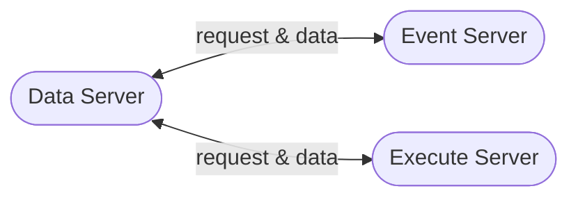

# Phoenix System Design

[TOC]

## System Framework

## Requirement

|Index|Requirement|
|:-:|:--|
|1|子系统架构|
|2|数据服务|
|3|数据结构|
|4|通讯协议|

### 子系统架构

系统间通过TCP/IP协议进行通讯，以便将来可以独立部署在单个服务器上。
构建一个基类，基类派生出三个子系统
需要构建一个应用层通讯协议

### 数据服务

从数据库服务器获取基础数据
进行数据运算
在本地服务中保留缓存，并进行生命周期管理
统计各类数据的使用特点，智能进行生命周期调度

### 数据结构

backtrader的数据结构定义为Line对象

### 数据缓存格式

### 数据生命周期管理

### 通讯协议

### 自动化文本挖掘

利用NLP方法对文本信息进行处理
读取PDF文件，提取文本
对文本进行NER，提取命名实体
收入NER库
根据NER进行Event Etract
将事件存入数据库
根据事件分类触发trigger一个Event
引擎对Event进行响应
